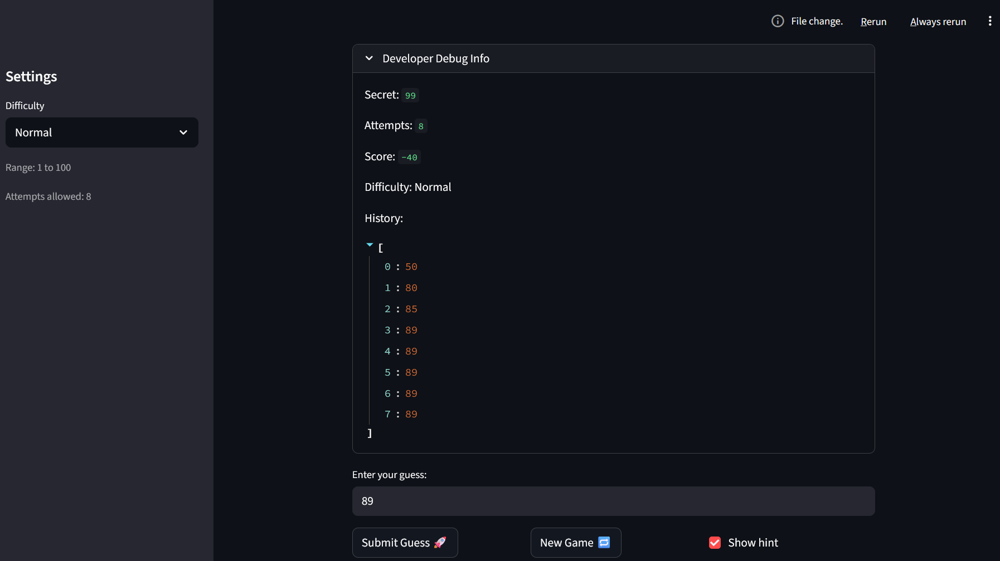
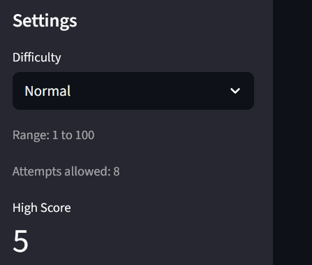

# 🎮 Game Glitch Investigator: The Impossible Guesser

## 🚨 The Situation

You asked an AI to build a simple "Number Guessing Game" using Streamlit.
It wrote the code, ran away, and now the game is unplayable. 

- You can't win.
- The hints lie to you.
- The secret number seems to have commitment issues.

## 🛠️ Setup

1. Install dependencies: `pip install -r requirements.txt`
2. Run the broken app: `python -m streamlit run app.py`

## 🕵️‍♂️ Your Mission

1. **Play the game.** Open the "Developer Debug Info" tab in the app to see the secret number. Try to win.
2. **Find the State Bug.** Why does the secret number change every time you click "Submit"? Ask ChatGPT: *"How do I keep a variable from resetting in Streamlit when I click a button?"*
3. **Fix the Logic.** The hints ("Higher/Lower") are wrong. Fix them.
4. **Refactor & Test.** - Move the logic into `logic_utils.py`.
   - Run `pytest` in your terminal.
   - Keep fixing until all tests pass!

## 📝 Document Your Experience

- [x] Describe the game's purpose.
      The game is a number guesser where the user must guess numbers between 1-100. The user should guess a number and be given a hint by the game if they need to guess higher or lower. 
- [x] Detail which bugs you found.
   Allowing users to guess numbers out of bounds, attempts allowed not being accurate functionally, the hints were reversed.
- [x] Explain what fixes you applied.

## Secure Coding Implementations 

**STRIDE Threat Model**  
I've implemented the following security methodologies:

- **D (Denial of Service):** Added per-session rate limiting with a cooldown (0.20s between submits) and a rolling window cap (4 submits per 60 seconds) to prevent spam/abuse of the game state.

- **R (Repudiation):** Implemented session audit trail (`event_log`) that records all security-relevant events: `submit`, `rate_limited_cooldown`, `rate_limited_window`, `new_game`, `win`, and `loss` with timestamps for accountability.

**Additional STRIDE Considerations (Design-Level, Not Implemented):**
- **T (Tampering):** High-score file (`high_score.json`) is trusted local input; could be hardened via signed hashes, file-level ACLs, or SQLite integrity constraints.
- **S (Spoofing):** No user identity model; score ownership is unverifiable. Could add local login, device ID binding, or server-issued session tokens.
- **I (Information Disclosure):** Debug panel exposes secret number intentionally (for dev workflow); could gate behind a `DEBUG_MODE` flag if deployed.
- **E (Elevation of Privilege):** Debug actions (reset state, reveal answer) are unrestricted. Could add role-based access control (RBAC) for privileged actions.

## 📸 Demo

- [x] [Insert a screenshot of your fixed, winning game here]

## 🚀 Stretch Features

- [ ] [If you choose to complete Challenge 4, insert a screenshot of your Enhanced Game UI here]
